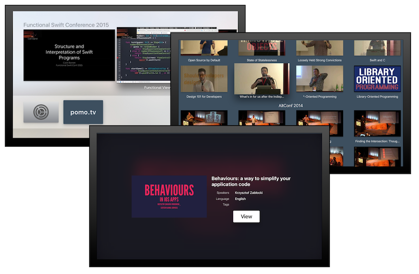

# pomo.tv tvOS Client

This Apple TV app allows you to browse and play the videos listed on http://www.pomo.tv/

I hacked this together in a day, so the quality is not great. Use at your own risk.

## Features & ToDos
- [x] list recent videos (top shelf extension)
- [x] list all videos
- [x] play YouTube videos
- [x] play Vimeo videos
- [ ] play WWDC videos
- [ ] browse speakers
- [ ] browse tags
- [ ] Search

## Setup
- clone the repo
- run `pod install` to install the dependencies
- open `pomotv-tvos-client.xcworkspace` and run the app

## Acknowledgements
*pomotv-tvos-client* uses these third-party libraries:

- [Alamofire](https://github.com/Alamofire/Alamofire)
- [AlamofireImage](https://github.com/Alamofire/AlamofireImage)
- [Alamofire-YamlSwift](https://github.com/phimage/Alamofire-YamlSwift)
- [YamlSwift](https://github.com/behrang/YamlSwift)
- [XCDYouTubeKit](https://github.com/0xced/XCDYouTubeKit)
- [YTVimeoExtractor](https://github.com/lilfaf/YTVimeoExtractor)

## License
*pomotv-tvos-client* is released under the MIT license. See LICENSE for details.
